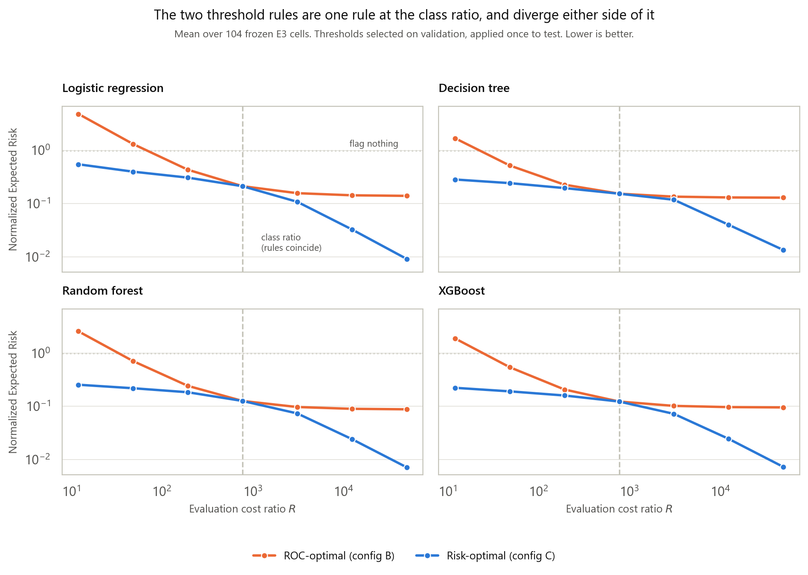

# E6 — Threshold-rule divergence across the evaluation cost ratio

**Execution status: PASS.** 104/104 designated cells, 1,664 evaluation rows,
832 paired comparisons, 0 skipped. Quality control 15/15 PASS. Smoke test 8/8
PASS.

Frozen baseline `b2e6f624` unchanged. No model was fitted: the experiment reads
the probability vectors E3 cached for **validation and test**, re-selects
thresholds on validation alone, and applies them once to test. `R_train` never
varies — only the evaluation ratio moves.

> **Research question.** At `R = N₋/N₊` the ROC-optimal and risk-optimal
> thresholds are provably the same threshold. Does that equivalence hold
> exactly in measurement, and how do the two rules diverge away from that
> ratio?

---

## A. Why this experiment exists

Audit finding M5 recorded that configurations B and C are **degenerate at the
study's operating point**. Every headline number in this study sits at
`R = 773.70`, and at that ratio the two threshold rules are provably identical:

```
FP + R·FN  =  FPR·N₋ + R·(1 − TPR)·N₊
           =  N₋·(FPR + 1 − TPR)            when R = N₋/N₊
```

whose minimiser is exactly the maximiser of `TPR − FPR`. So the B-versus-C
comparison the study reports carries **no information at the point it is
reported at**. E6 sweeps `R_eval` across the class ratio so that the comparison
becomes informative, and so the equivalence is demonstrated rather than only
derived.

## B. Design — and one honest caveat about the grid

| | |
|---|---|
| Manipulation | `R_eval` swept; `R_train` frozen per cell |
| Cells | 104 — the same designated set E4 used |
| Levels | 8 (7 declared multipliers + 1 computed per cell) |
| Rules compared | B = `youden` (ROC-optimal), C = `ner_optimal` (risk-optimal) |
| Threshold protocol | selected on validation at each R, locked, applied once to test |
| Model / fits | frozen E3 cells; nothing refitted |
| Rows | 1,664 (104 × 8 × 2) |

**The grid was not pre-declared, and this report does not claim it was.** Unlike
E4, whose prevalence grid the audit specified, no `R_eval` grid was ever written
down for E6. The repair report fixes the *question* ("sweep R across the class
ratio", "runs entirely from cache") and E2 §H.7 fixes the *variable*, but the
levels are chosen in `scripts/experiments/E6_threshold_divergence.py`, closed
before execution, and recorded in the manifest as `grid_predeclared: false`.

The grid is geometric and log-symmetric about the class ratio — multipliers
`{1/64, 1/16, 1/4, 1, 4, 16, 64}` — because the claim under test concerns
distance from that ratio in either direction, so the levels must bracket it
evenly.

**An eighth level separates two things the study has always conflated.**
`R = 773.7011` is the *training* set's `N₋/N₊`. The *validation* set's own ratio
is 773.6688 — a factor of 1.0000417 apart. Every threshold in this study is
selected on validation, so the theorem's exact point is the validation ratio,
not the frozen constant. E6 evaluates both.

**Cache-only, structurally.** The script imports the study's canonical `risk`
module — so the threshold and NER definitions cannot drift from the ones the
notebooks use — through a stub package that bypasses `momo_fraud/__init__.py`,
which would otherwise pull in `models` and every estimator library. QC asserts
at runtime that no estimator module is loaded. This is stronger than E4, which
bought the same guarantee by reimplementing its metrics.

## C. The theorem holds — exactly, not approximately

At `R` = the validation class ratio, across all 104 cells:

| Quantity | Result |
|---|---|
| Cells where B and C select the **same** threshold | **104 / 104** |
| Maximum absolute threshold gap | **0.000e+00** |
| Maximum absolute ΔNER | **0.000e+00** |

Not "agree to six decimals" — bit-identical, for every learner, every split seed
and every model seed. The smoke test re-derives this independently of the
machinery that produced it, going straight to the sorted scan: `argmax(TPR −
FPR)` and `argmin(FP + R·FN)` land on the **same index, 22756**, in cell
`xgboost__weighted__split123__model456`.

**The equivalence survives the 0.004% approximation.** At the frozen
`R = 773.7011` — the training ratio, not the validation one — the rules still
agree in 104/104 cells. The study's long-standing conflation of the two ratios
is therefore harmless at this score resolution, which is worth stating because
it was never checked before.

## D. Divergence away from the ratio

`report/tables/E6_divergence.csv`, means over 104 cells. Lower NER is better;
NER = 1.0 is "flag nothing".

| R / class ratio | R_eval | Same threshold | NER, ROC-optimal (B) | NER, risk-optimal (C) | B / C |
|---|---|---|---|---|---|
| 1/64  | 12.09     | 0%      | **2.2641** | 0.2760 | 8.20× |
| 1/16  | 48.36     | 0%      | 0.6457 | 0.2310 | 2.79× |
| 1/4   | 193.43    | 15.4%   | 0.2411 | 0.1894 | 1.27× |
| **1** | **773.67**| **100%**| **0.1399** | **0.1399** | **1.00×** |
| 1     | 773.70    | 100%    | 0.1399 | 0.1399 | 1.00× |
| 4     | 3,094.80  | 7.7%    | 0.1147 | 0.0893 | 1.28× |
| 16    | 12,379.22 | 0%      | 0.1083 | 0.0297 | 3.64× |
| 64    | 49,516.87 | 0%      | 0.1067 | **0.0092** | 11.55× |

Three things follow.

**1. Config C never loses.** Across all 832 paired comparisons the minimum
ΔNER is **exactly 0.0** — there is no cell, at any ratio, where the ROC-optimal
threshold beats the risk-optimal one on test. The threshold is selected on
validation and still never loses on test, so this is generalisation, not
in-sample fitting.

**2. Below the class ratio, the ROC rule is worse than doing nothing.** At
`R = 12.09` the ROC-optimal threshold scores NER **2.2641** — and NER > 1.0 in
**100 of 832** paired rows, peaking at **6.3756**. When false alarms are
relatively expensive, Youden's threshold flags so much that the alerts cost more
than the fraud they catch. A practitioner following "use the ROC-optimal
threshold" at a low cost ratio is worse off than switching the system off.

**3. Above the ratio, the ROC rule stalls.** B plateaus at NER ≈ 0.107 while C
continues to 0.0092. At 64× the class ratio the mean per-learner penalty for
using the ROC rule is 9.6× (decision tree) to 15.3× (logistic regression). The
mechanism is visible in the operating point: at that ratio B flags 33,239
transactions at recall 0.894, while C flags 430,010 at recall **0.998**. Youden
cannot be told that missing fraud has become 64× more expensive, because it
never consumes a cost ratio at all.

**The divergence is asymmetric.** Mean absolute threshold gap by distance:

```
below the ratio:  0.1266  ->  0.2165  ->  0.2822
above the ratio:  0.1141  ->  0.1595  ->  0.1613
```

Monotone in each direction, but steeper below. QC tests the two directions
separately for exactly this reason: pooling them interleaves two different
sequences and destroys the ordering being claimed.



## E. What this does to the literature disagreement

Aleksandrova & Armianova (2022) reported ROC-optimal and consequence-optimal
thresholds producing opposite outcomes, and the finding entered the literature
as a contrast between a "statistical" and a "business" threshold. E6 measures
the same contrast and finds it is neither: it is a contrast between **two cost
ratios**, and its size is a function of the distance between them.

At zero distance the two rules are one rule, in 104 of 104 cases with a gap of
exactly zero. The disagreement is real but it is not about statistics versus
business — it is about how far the operating cost ratio sits from the class
ratio, and it is predictable in both direction and magnitude.

This is a stronger claim than the study could previously make, because it
dissolves the disagreement rather than citing it.

## F. Limitations still live after E6

1. **The grid is chosen, not pre-declared** (§B). It is closed and symmetric,
   but a reader is entitled to know it was selected by the analyst.
2. **One threshold rule pair.** B and C only. Nothing here speaks to per-instance
   severity thresholding, which `optimal_threshold(severity=...)` supports and
   which config F would need to be scored under (see
   `docs/config_f_cost_objectives.md`).
3. **`R_train` is frozen at each cell's own value.** E6 varies only the
   evaluation ratio, so the train/eval mismatch is measured at 8 evaluation
   points against 1 training point per cell — not as a full `R_train × R_eval`
   grid. E2 covers the other margin.
4. **Score granularity bounds the equivalence claim.** The rules agree exactly
   here; at much finer score resolution, or with a model whose ROC has a flat
   maximum, the argmax and argmin could in principle land on adjacent
   candidates. The claim is that they did not, in 104 cells.
5. **The 104 cells are `unweighted` and `weighted` only.** RUS and instance
   weighting are absent, matching E4's designated set.
6. **One dataset, one feature rung, one simulator.** As everywhere else in this
   study.

## G. What this changes in the write-up

1. The threshold-equivalence claim moves from **derived** to **derived and
   measured**, with 104/104 exact agreement as the evidence.
2. The B-versus-C comparison at the frozen R should be reported as
   **degenerate by construction** — not as a result — and E6 cited as the place
   the comparison is actually made.
3. The "statistical versus business threshold" framing should be stated and then
   dissolved (§E), not repeated.
4. Any recommendation to use a ROC-optimal threshold needs the qualification in
   §D.2: below the class ratio it can be worse than flagging nothing.
5. Every reported NER should carry the ratio it was evaluated at, as E4 already
   requires for prevalence.

## H. Recommended next, not run

- **Threshold re-selection under prevalence shift** — the complement to E4's
  fixed-threshold design. Still unexecuted, still cache-only.
- **A severity-aware threshold arm**, which would make config F self-consistent
  across training, thresholding and scoring. This remains a research decision,
  not a repair.

Neither has been executed.
